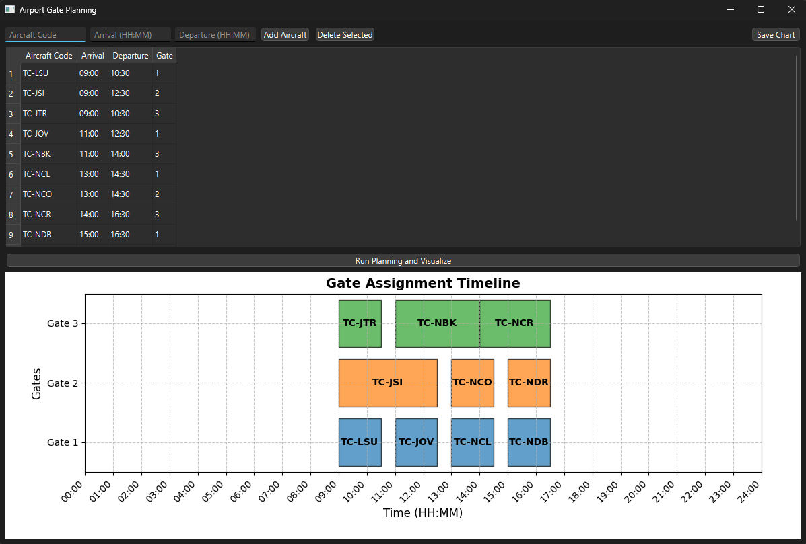

# Gate Planning with Interval Partitioning Algorithm

This project was developed for the "MAT 333E Data Processing Algorithms" course at Istanbul Technical University. The purpose is to calculate the number of gates required in an airport using the **Interval Partitioning Algorithm**.

## Key Features
- Implements **Interval Partitioning Algorithm** for optimal gate assignments.
- A PyQt6-based GUI to manage, visualize, and plan aircraft schedules.
- Automatically calculates the minimum number of gates required.
- Interactive table and visualization of gate assignments with a timeline.

## How It Works
1. **Input Flights**: Add aircraft with their arrival and departure times.
2. **Run Planning**: Calculate gate assignments ensuring no overlap using the algorithm.
3. **Visualize**: Display the gate schedule in an interactive chart.

## Interval Partitioning Algorithm
- Sorts flights by arrival time.
- Assigns flights to existing gates where no time conflicts occur.
- Creates new gates only when necessary, ensuring optimal resource use.

## Screenshot
